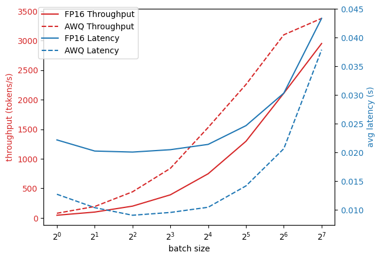
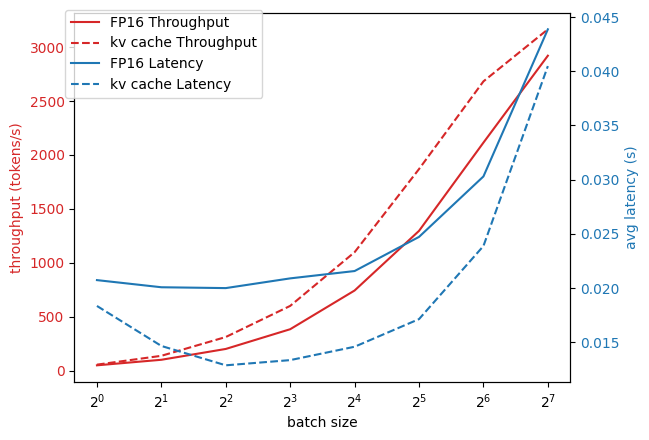
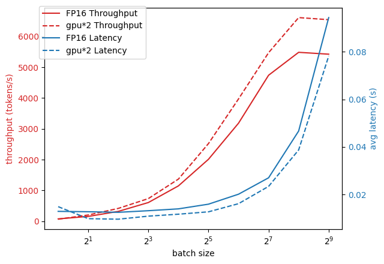

1. 云端加速1：基于vLLM在Qwen2-7b大模型上，加速前后的的效果对比。需要对比的实验如下：
- INT4/AWQ量化前后的对比 ✅
- INT8 KV Cache量化前后对比 ✅
- 单卡推理和2卡推理的对比

每个实验都分别统计单条推理延时，以及并发量分别为4，8，16，32下的吞吐率throughput的压力测试

## 实验环境
- RTX 4090
- Cuda 12.1
- vLLM 0.7.3
- Pytorch 2.5.1
- Transformers 4.49.0

## 实验结果

### INT4/AWQ量化前后的对比

### INT8 KV Cache量化前后对比

### 单卡推理和2卡推理的对比

